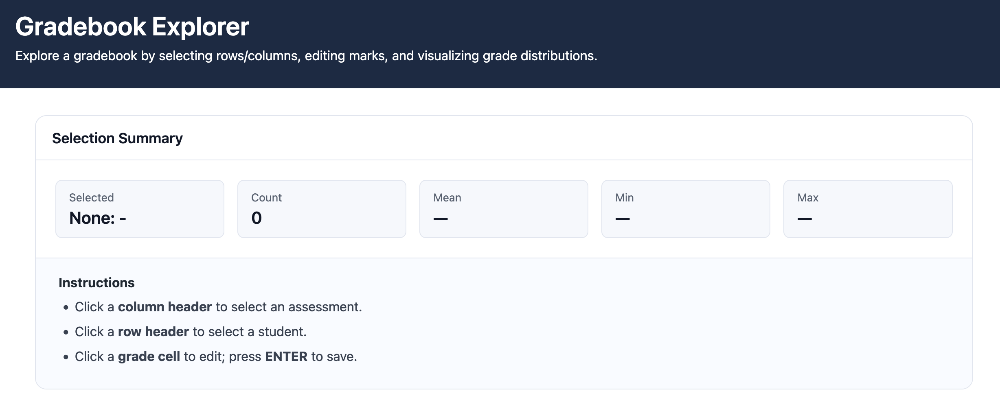
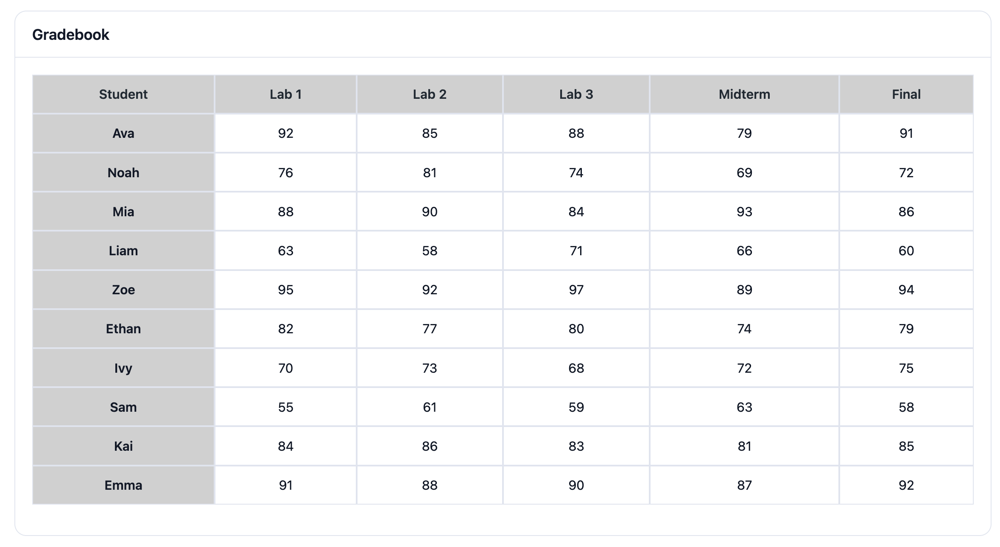
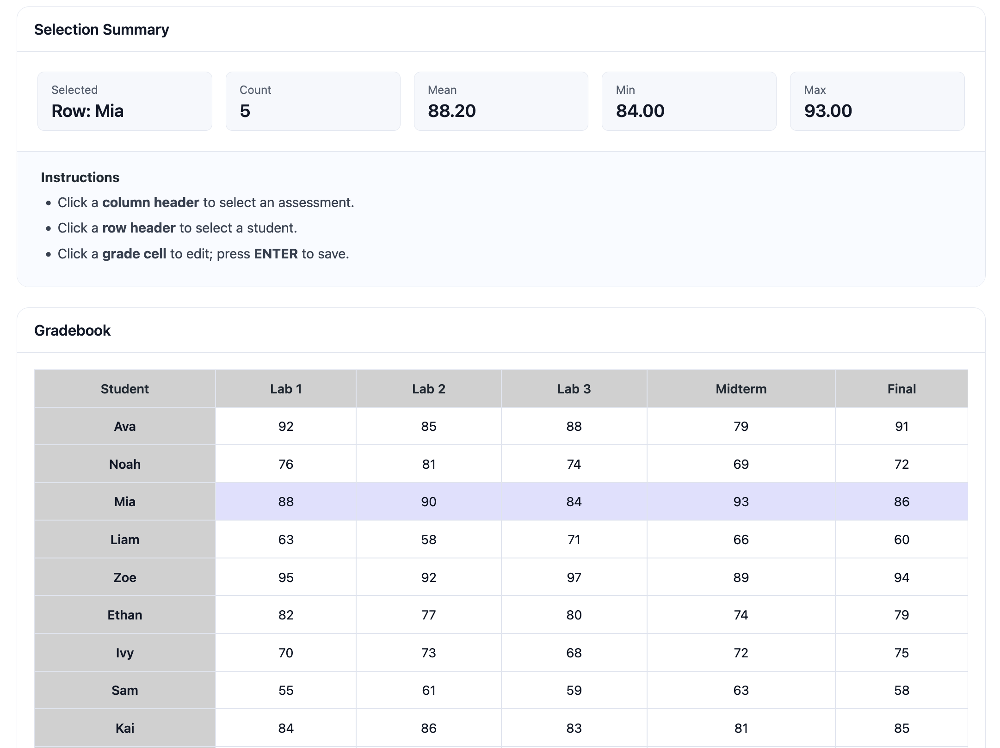
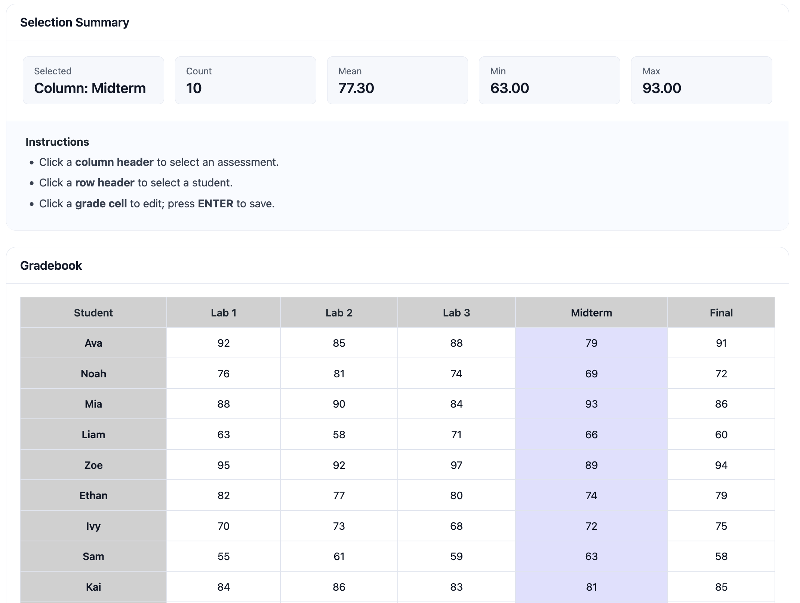
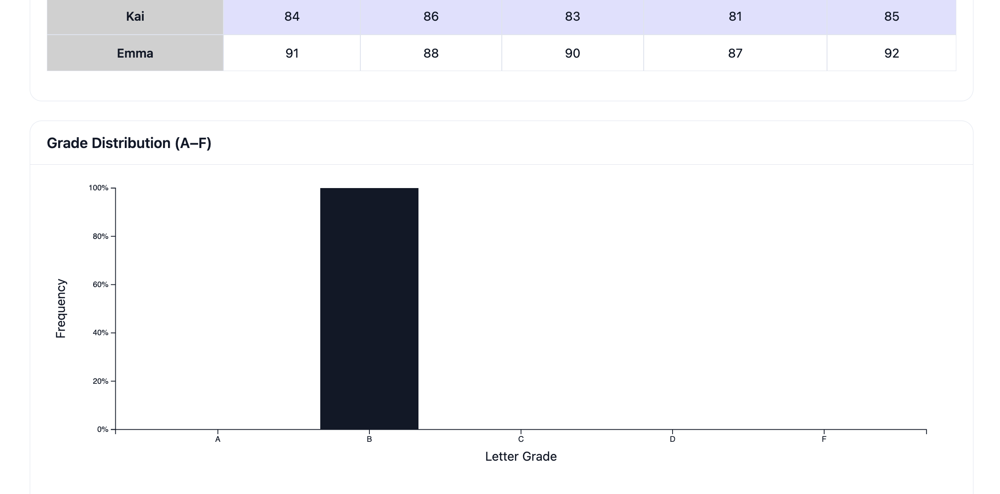

# Lab 04-06: Gradebook Explorer

Gradebook Explorer is a browser-based gradebook viewer for CSCI 3230U Web App Development Labs 04-06. It loads grade data from a CSV file, renders it as an interactive spreadsheet, summarizes selected rows or columns, supports inline grade editing, and visualizes the selected grade distribution with D3.



## Features

- Loads student grades from `src/data/grades.csv`
- Builds the gradebook table dynamically with JavaScript and jQuery
- Selects a student row or assessment column
- Highlights the active row or column in the spreadsheet
- Calculates count, mean, minimum, and maximum for the active selection
- Edits grade cells directly in the table
- Validates grades so values stay between 0 and 100
- Displays an A-F letter-grade distribution chart with D3

## Screenshots

### Gradebook Table



### Row Selection



### Column Selection



### Grade Distribution Chart



## Project Structure

```text
.
├── README.md
├── images/
│   ├── img1.png
│   ├── img2.png
│   ├── img3.png
│   ├── img4.png
│   └── img5.png
└── src/
    ├── css/
    │   └── spreadsheet.css
    ├── data/
    │   └── grades.csv
    ├── js/
    │   ├── chart.js
    │   ├── gradebook.js
    │   └── spreadsheet.js
    └── pages/
        └── spreadsheet.html
```

## How to Run

The app fetches `grades.csv`, so it should be served from a local web server instead of opened directly with `file://`.

From the project root, run:

```bash
python3 -m http.server 8000
```

Then open:

```text
http://localhost:8000/src/pages/spreadsheet.html
```

## How to Use

Click a column header, such as `Midterm`, to summarize that assessment across all students.

Click a row header, such as `Mia`, to summarize that student's grades across all assessments.

Click any grade cell to edit it. Press `Enter` to save the new grade, or press `Escape` or blur the input to cancel the edit.

## Implementation Notes

- `gradebook.js` handles CSV parsing, grade storage, summary calculations, grade validation, and letter-grade frequency conversion.
- `spreadsheet.js` renders the table, wires up jQuery interactions, updates selection state, and refreshes the summary panel.
- `chart.js` renders and updates the D3 bar chart for A-F grade frequencies.
- `spreadsheet.css` contains the layout, table, card, selection, editing, and responsive styles.
